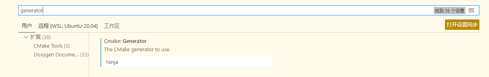

# windows简单配置wsl & vscode &C++开发环境

[toc]

## wsl的安装

1. 打开功能，启用wsl系统
2. 去microsoft store搜索linux
3. 选一个喜欢的下载，我选的是debian(debian装完是真的“简陋“，一步一步配置能学到很多linux知识，不喜欢配置的同学建议直接使用ubuntu)
4. 以下以debian为例

## wsl安装后配置

1. 换源
阿里源：<https://developer.aliyun.com/mirror/>

`sudo mv /etc/apt/sources.list /etc/apt/sources.list.bak`

`sudo nano /etc/apt/sources.list`
或者`sudo apt edit-sources`

复制下方链接粘贴进新文件，然后保存退出。

```
deb http://mirrors.aliyun.com/debian/ bullseye main non-free contrib
deb-src http://mirrors.aliyun.com/debian/ bullseye main non-free contrib
deb http://mirrors.aliyun.com/debian-security/ bullseye-security main
deb-src http://mirrors.aliyun.com/debian-security/ bullseye-security main
deb http://mirrors.aliyun.com/debian/ bullseye-updates main non-free contrib
deb-src http://mirrors.aliyun.com/debian/ bullseye-updates main non-free contrib
deb http://mirrors.aliyun.com/debian/ bullseye-backports main non-free contrib
deb-src http://mirrors.aliyun.com/debian/ bullseye-backports main non-free contrib
```
更新软件源
```
sudo apt update
sudo apt upgrade
```

2. 安装必要软件 `sudo apt install g++ gdb cmake`

## vscode安装后配置

## 【可选】wsl安装其他软件

```
sudo apt install vim htop openjdk-17-jdk manpages-zh git 
```

## 【可选】clang

## 【可选】lldb

坑：lldb无法在wsl1上使用

## 【可选】ninja

1. wsl安装ninja:

``sudo apt install ninja-build``

2. vscode修改build改为ninja:

按 `ctrl+,`之后搜索generator改为Ninja

## 参考文章：[VS Code + clang + lldb - sinferwu - 博客园 (cnblogs.com)](https://www.cnblogs.com/sinferwu/p/15353427.html)
